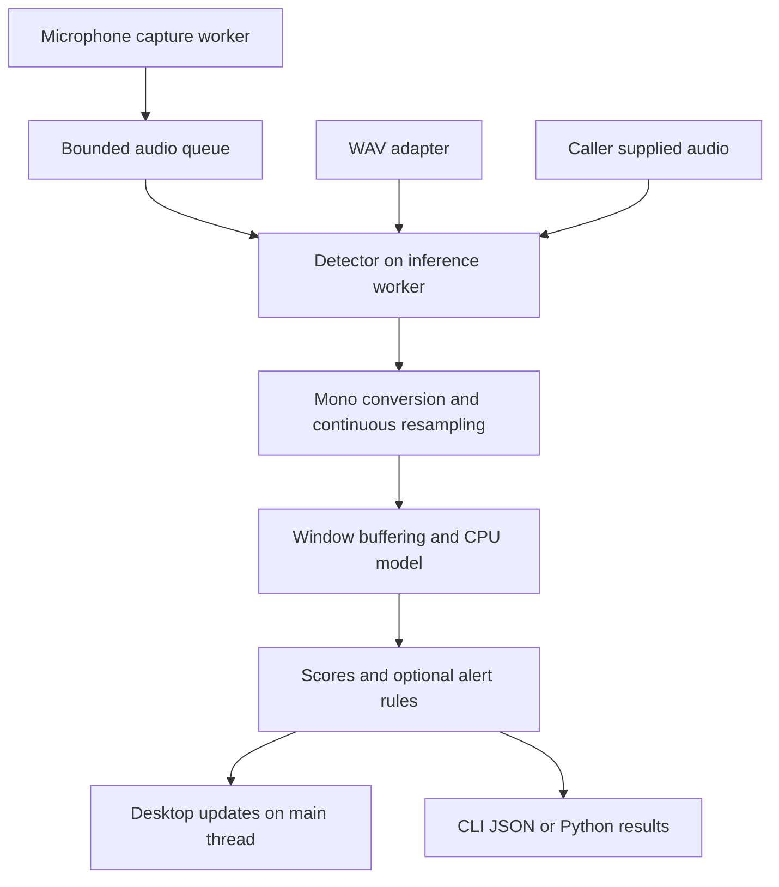

# Architecture and portability

HearSafe has a shared detector and replaceable input adapters. The desktop
window is one client; another program can supply its own audio and consume
structured results. The engine never opens a microphone itself.



## Implemented input contract

- `Detector.process(audio, sample_rate)` accepts consecutive floating-point
  samples in `[-1, 1]`, as mono or samples-by-channels arrays.
- The caller supplies the actual integer sample rate. Integer PCM must first be
  scaled to normalized floats. Nonfinite samples are rejected.
- Stereo is mixed to mono; continuous SoXR resampling preserves filter state
  across chunks. Device audio can use its supported 44.1 or 48 kHz rate.
- Overlapping model windows are buffered internally. `flush()` pads a remaining
  file tail once; `reset()` clears audio, resampling, timing, and alert state.
- After a gap or rate change, reset before feeding new audio. Timing starts at
  zero in each new continuous segment. Construct a new detector for a model
  switch. Call one detector from one inference worker.

The microphone adapter copies input into a bounded queue, without inference or
disk access inside the audio callback. Inference and Tkinter updates run
separately. Overflow and device errors are reported. Detection state resets
after dropped audio; denied, busy, or disconnected input stops capture and asks
the user to select a device again. Raw audio is not recorded.

## Versioned result contract

One JSON line is an analysis frame with predictions and optional watchlist
events. A single event has this shape:

```json
{
  "schema_version": 1,
  "model_id": "yamnet-mediapipe-v1",
  "label_id": "/m/0bt9lr",
  "label": "Dog",
  "score": 0.91,
  "time_ms": 1935.0,
  "state": "started"
}
```

Times are **audio-relative milliseconds**, not wall-clock timestamps. Model ID
plus label ID identifies a category; YAMNet and ESC-50 labels are different.
Scores describe model output, not verified correctness. Consumers choose how
to display or use a result. CLI diagnostics stay on standard error.

Alerts are disabled until the user enables a watchlist. Each category has a
threshold and cooldown. Sustained events require repeated evidence; brief
events can use one strong result. A continuous sound generates one alert until
it falls below the rearming level for two windows and the cooldown expires.
Overlapping categories can generate separate selected events.

## Model packages

Each package contains `manifest.json`, labels, a model file, checksum,
preprocessing settings, model ID/version, and provenance. The loader validates
the package and tensor interface before capture. The portable model is pinned
YAMNet through LiteRT CPU. Locally trained research models use ONNX Runtime CPU
and the same NumPy frontend used during training; training normalization is
embedded in ONNX. PyTorch is only needed for training and export.

## Distribution and hardware

The first portable ZIP bundles Windows x64 executables, runtime libraries,
YAMNet, and third-party notices. Keep the whole extracted folder together.
Inference works offline; explicit model download belongs to source setup.
The build runs a smoke check from a relocated folder containing spaces.

A microphone still needs a computer or board to run the model. Linux and
Raspberry Pi are future source deployment targets, requiring compatible runtime
packages and measurements on the actual hardware. This Windows ZIP cannot run
there. Small microcontrollers require a separate model and runtime assessment.
System-audio capture and categories trained from user recordings are later work.

For acceptance procedures, see [testing](testing.md). For API and CLI examples,
see [integration](integration.md). Published measurements and unperformed
hardware checks are listed in [prototype results](../reports/prototype_results.md).
